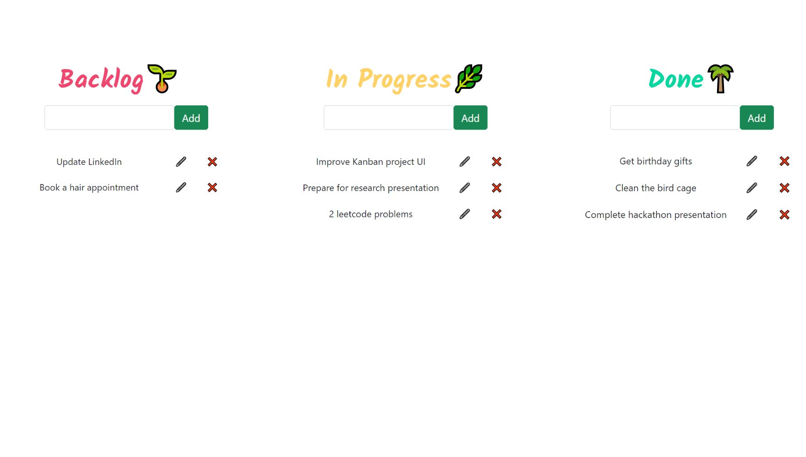
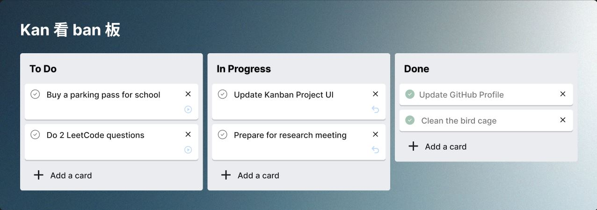

# :pencil: Kanban PERN Full Stack Application

* **Kanban:** a visual project management system that optimizes workflow efficiency. 
	* A Kanban board consists of a visual representation of tasks or work items organized into different columns.
	*  Each column represents a different stage in the workflow, and work items move across the board as they progress through these stages.
* **PERN Stack:** PostgreSQL, Express, React, Node
	* This full-stack app integrates a React frontend with a Node.js backend.

## :bulb: General info

### Backend
* PostgreSQL as database
* Node.js and Express to build the backend services and a RESTful API that performs CRUD operations. (Create, Read, Update, Delete)

### Frontend

* React frontend includes a 3 columns **backlog**, **in progress**, and **done**. 
* User can edit and delete tasks in the respective columns and move them through each workflow step. 

## :camera: Screenshots
*Current User Interface*

*Newly designed UI made through Figma.*

